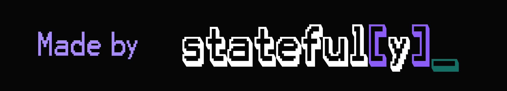

{width=800}
{width=800}

# Welcome to Sklearn-Optuna's documentation

`OptunaSearchCV` is a drop-in replacement for Scikit-Learn's `GridSearchCV` and `RandomizedSearchCV` powered by [Optuna](https://optuna.org/). It extends `BaseSearchCV`, so `fit()`, `score()`, `best_params_`, `cv_results_`, pipelines, and `clone()` all work out of the box. Optuna samplers (TPE, CMA-ES, ...) explore search spaces more efficiently than grid or random search, while Optuna distributions give you log-scaled, bounded, and categorical parameter spaces.

!!! note "Inspiration"
    This project is inspired by [optuna-integration's OptunaSearchCV](https://optuna-integration.readthedocs.io/en/latest/reference/generated/optuna_integration.OptunaSearchCV.html).

-  **Get Started in 5 Minutes**

    ---

    Install Sklearn-Optuna and run your first hyperparameter search.

    [Getting Started](pages/tutorials/getting-started.md)

- **How-to Guides**

    ---

    Task-oriented guides for samplers, callbacks, persistence, pipelines, and more.

    [How-to Guides](pages/how-to/configure-samplers.md)

- **See It In Action**

    ---

    Explore interactive notebooks from quickstart to pipelines.

    [Examples](pages/tutorials/examples.md)

- **API Reference**

    ---

    Complete API documentation for OptunaSearchCV and wrapper classes.

    [API Reference](pages/reference/api.md)

## License

This project is licensed under the terms of the [Apache-2.0 License](https://github.com/stateful-y/sklearn-optuna/blob/main/LICENSE).

## Acknowledgements

This project is maintained by [stateful-y](https://stateful-y.io), an ML consultancy specializing in data science & engineering. If you're interested in collaborating or learning more about our services, please visit our website.

{width=200}
